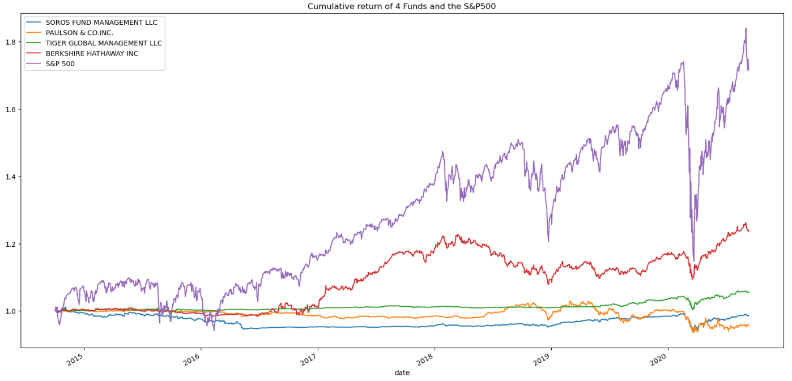
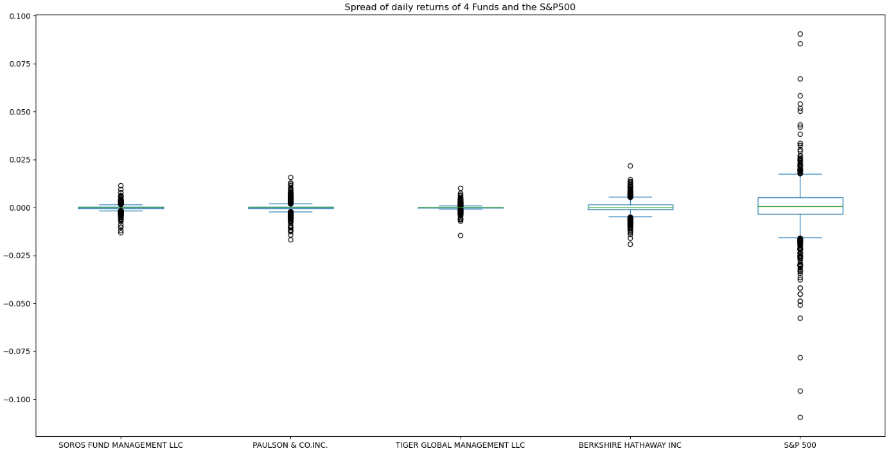
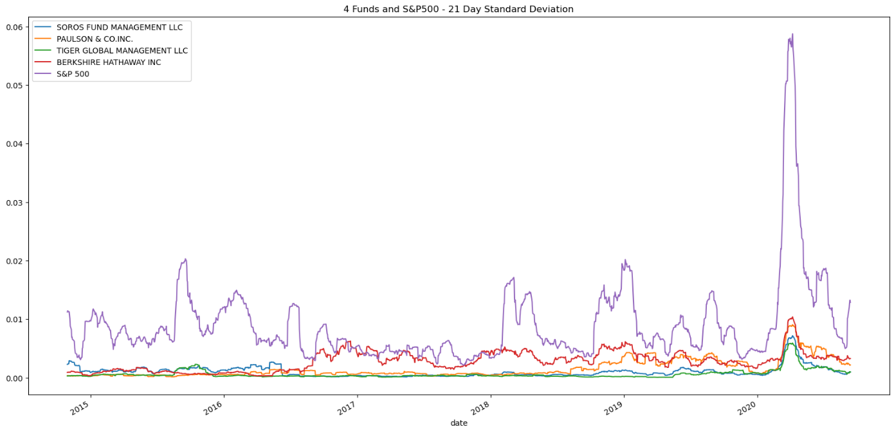
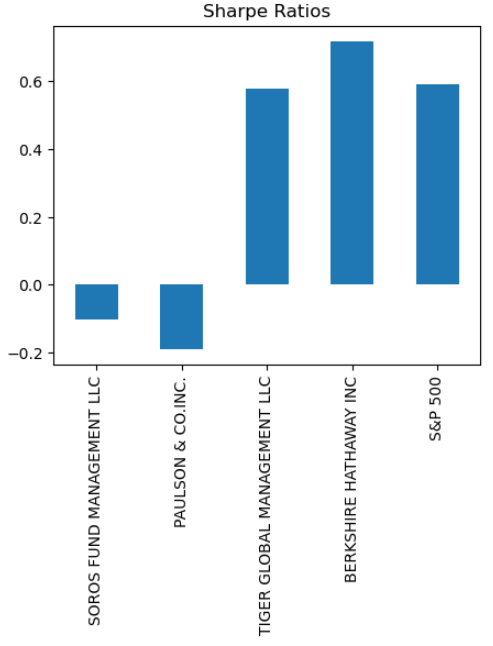
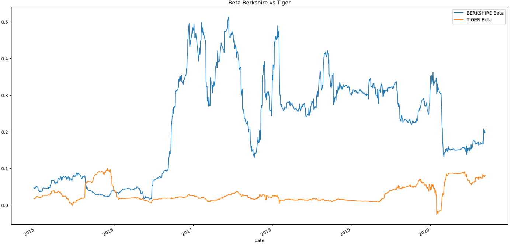

# Risk Return Analysis

Simulating a FinTech investing platform, we evaluate four investment options for inclusion in the client portfolios. We determine the fund with the most investment potential based on key risk-management metrics: the daily returns, standard deviations, Sharpe ratios, and betas.

* **Performance analysis**: Analyzing the data to determine if any of the portfolios outperform the broader stock market, which the S&P 500 represents.
* **Volatility analysis**: Analyzing the volatility of each of the four fund portfolios and of the S&P 500 Index by using box plots.
* **Risk analysis**: Evaluating the risk profile of each portfolio by using the standard deviation and the beta.
* **Risk-Return Profile analysis**: Evaluating Sharpe Ratios.
* **Porfolio diversification**: Evaluating how the portfolios react relative to the broader market.

The report then provides investment advice based on the analysis.

---

## Technologies

The whole project is implemented in Python, writen in Jupyter lab using the Pandas and Numpy libraries and matplotlib for plotting: 

* ```import pandas as pd```
* ```import numpy as np```
* ```from pathlib import Path```
* ```%matplotlib inline```

The main ```risk_return_analysis.ipynb``` file reads from the csv file contained in the 'Resources' folder (```whale_navs.csv```).

---

## Usage

Run the main ```risk_return_analysis.ipynb``` from the console. You will get the full risk-return analysis report and can read the main conclusions marked-down in the comments along the descriptive charts. 

Some snapshots of the main parts of the analysis are:

1. **Performance analysis**



2. **Volatility analysis**



3. **Risk analysis**



4. **Risk-Return Profile analysis**



5. **Porfolio diversification**




In the conclusion, Bershire and Tiger are compared in more detail, and we recommend picking Bershire, since it offers significantly better returns (cum 1.24 vs 1.06 in Tiger) while keeping a std deviation significantly lower than the market (as shown by its higher Sharpe Ratio).

---

## Contributors

Feature developed by Lourdes Dominguez [(LinkedIn profile)](https://www.linkedin.com/in/lourdes-dominguez-bengoa-12333044/)

---

## License

Use only for academic purposes.